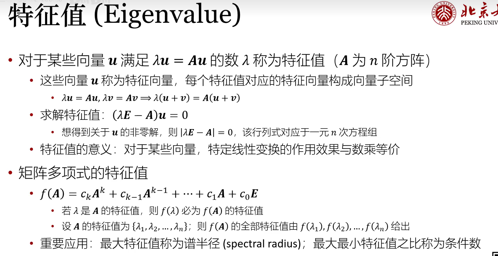
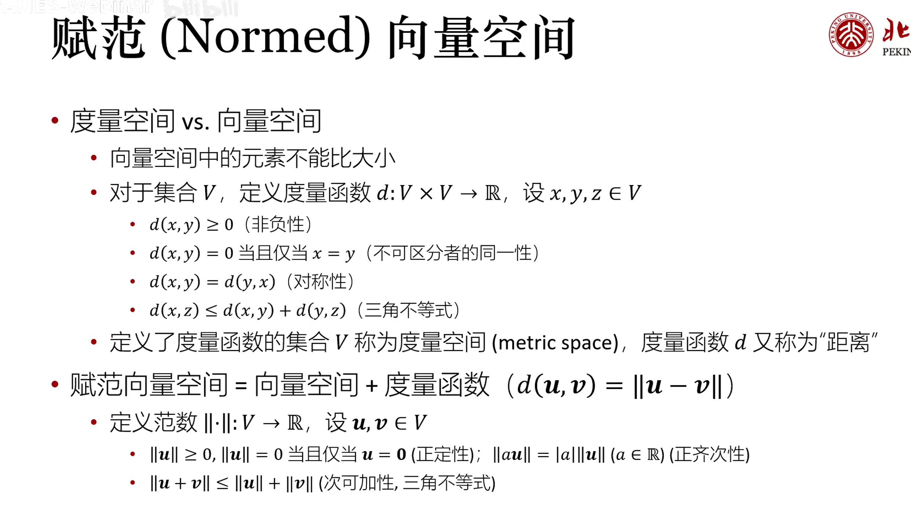
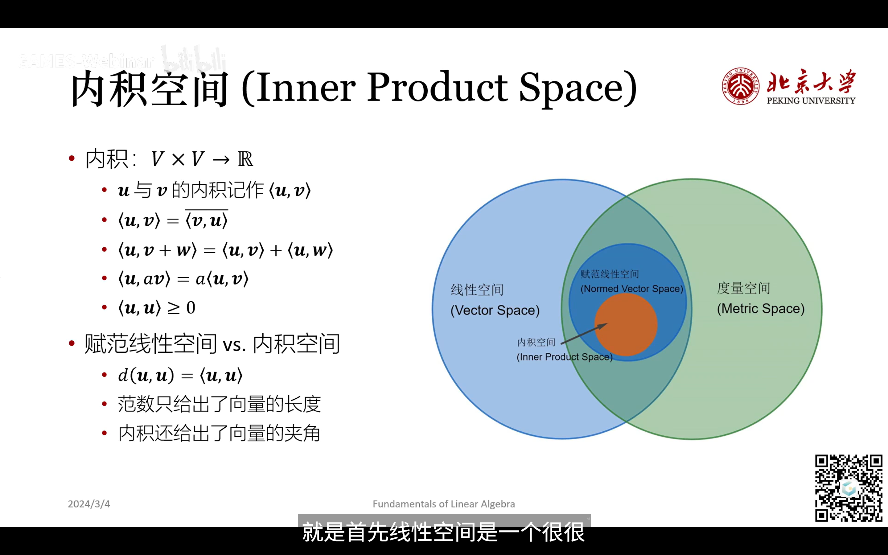
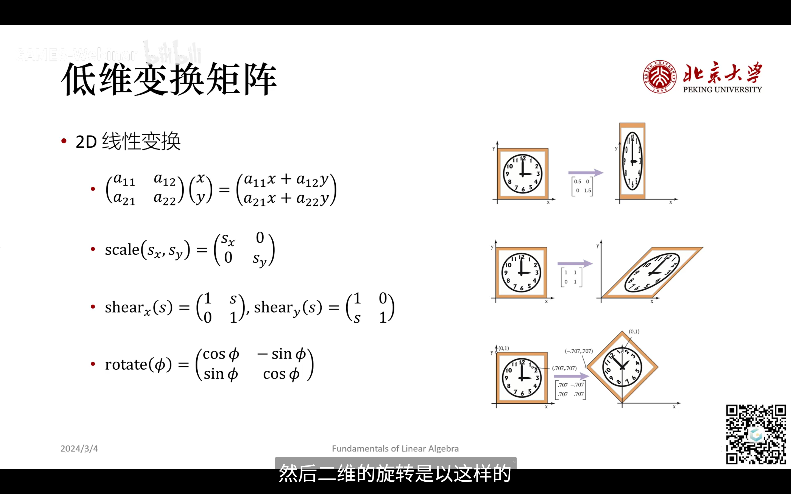
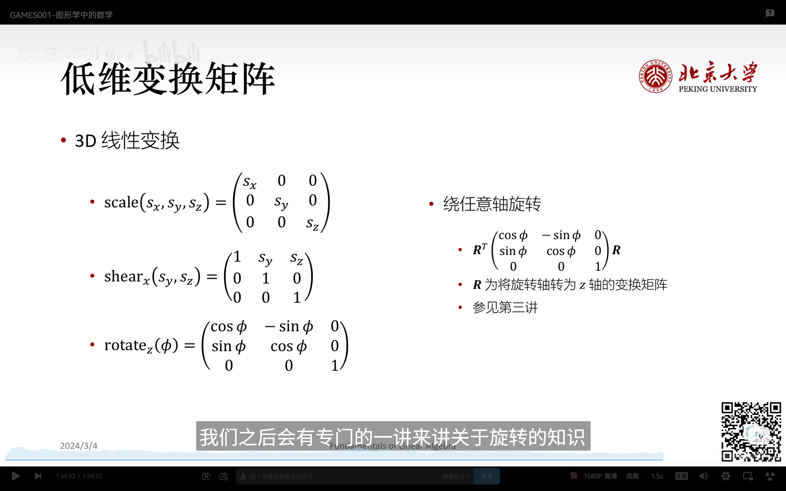
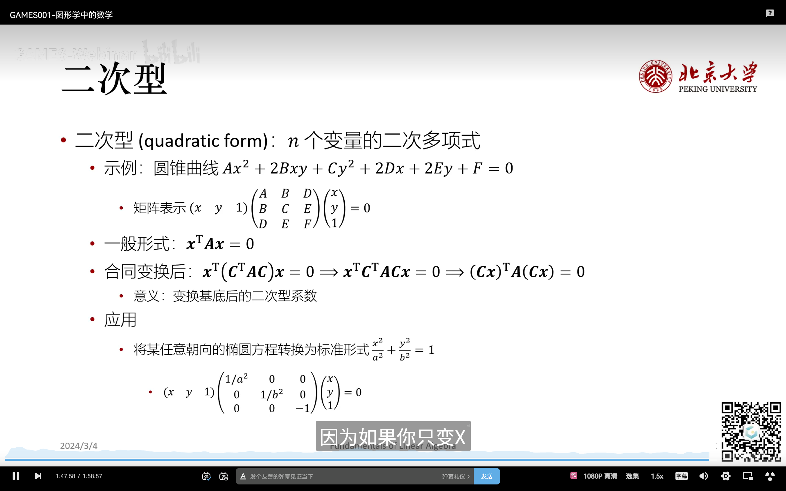
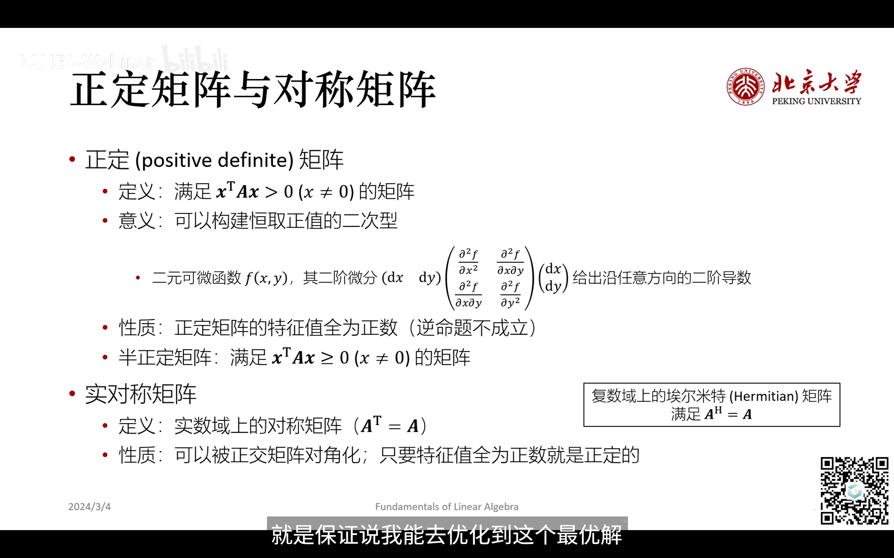

向量空间

通过二维和三维去直观理解向量，但是使用的时候用很高的维度
在高维空间中，向量的性质和运算方式与低维空间类似，但我们无法直接可视化高维空间的几何形状。

线性组合
线性组合是指将向量的标量倍数相加得到一个新的向量。它是向量空间中最基本的运算之一。

唯一性

线性映射

特征值

度量空间

相似变换和合同变换
相似变换是指通过可逆线性变换将一个矩阵转换为另一个矩阵的过程。两个矩阵相似意味着它们具有相同的特征值和特征向量结构。
合同变换是指通过正交变换将一个矩阵转换为另一个矩阵的过程。两个矩阵合同意味着它们具有相同的二次型结构。

